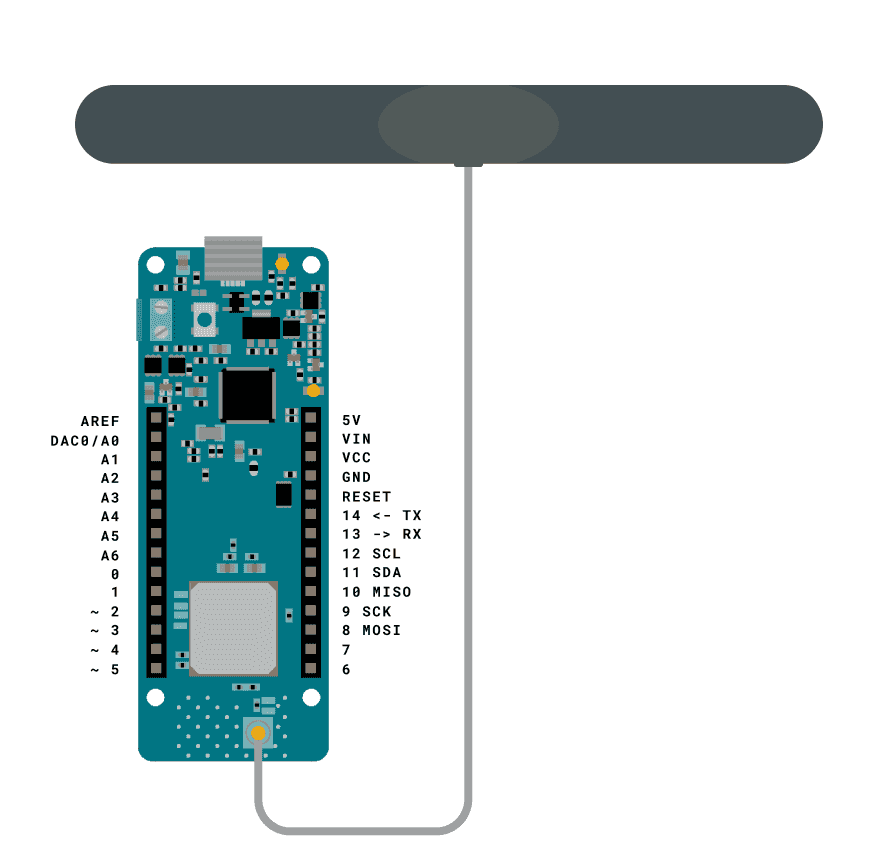
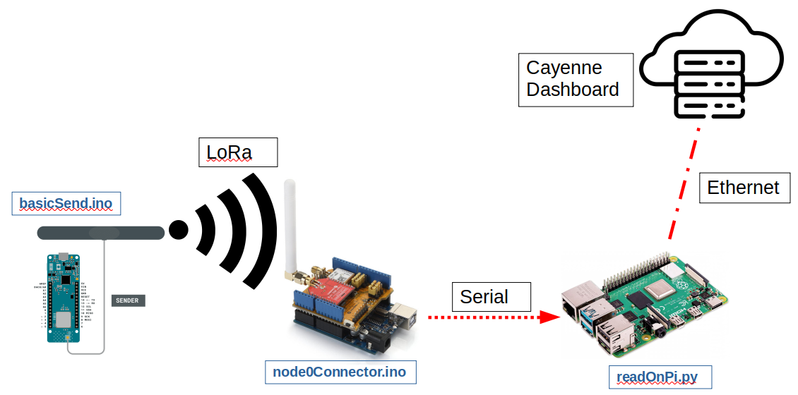

# Environmental Sensors

## Purpose: 

The purpose of this project was to establish sensor nodes that would collect environmental data such as tempurature, pressure, humidity etc.  The data is then send to a cloud service via a Raspberry Pi.  The environmental data is then displayed onto a dashboard for viewing.

## Materials used: 
1. Arduino MKR ENV 1300 series
	- Arduino MKR ENV Shield 
	- Dipole Antenna for Arduino
2. Arduino Uno series
	- Dragino Lora shield v95 (915MHz for North America) 
3. Raspberry Pi with Raspberry Pi OS installed
4. Seeed VOC and CO<sub>2</sub> sensor -> https://wiki.seeedstudio.com/Grove-VOC_and_eCO2_Gas_Sensor-SGP30/

## Setup: 
### Collecting Environmental Data ~ 
- Required Kit: 
	1. Arduino MKR WAN 1300 series -> https://store-usa.arduino.cc/products/arduino-mkr-wan-1300-lora-connectivity
	2. Arduino MKR ENV Shield      -> https://www.arduino.cc/en/Guide/MKRENVShield
	3. Dipole Antenna for Arduino  -> https://store.arduino.cc/products/dipole-pentaband-waterproof-antenna

**Setup for environmental collection:**

1. Mount the MKR ENV Shield on the MKR WAN 1300 series
	- The ENV shield itself collects the following environmental data: temperature, humidity, pressure, UV Index, UVB, UVA, and illuminance.  You will need to ensure the "Arduino_MKRENV" library is downloaded from the library manager via the Arduino IDE.  This is the library that is used to collect the data where you can use the 'read' methods in order to read the data[^1].   

		```C++
		#include <Arduino_MKRENV.h>
		
		void setup() {
		    Serial.begin(9600);
		    while (!Serial);
		    
		    if (!ENV.begin()) {
		        Serial.println("Failed to initialize MKR ENV shield!");
		    while (1);
		    }
		}
		void loop() {
		
		    // read all the sensor values
		    float temperature = ENV.readTemperature();
		    float humidity    = ENV.readHumidity();
		    float pressure    = ENV.readPressure();
		    float illuminance = ENV.readIlluminance();
		    float uva         = ENV.readUVA();
		    float uvb         = ENV.readUVB();
		    float uvIndex     = ENV.readUVIndex();
		    /* ------ etc. ------*/
		```    

2. Connect the Arduino with the shield mounted to the computer via USB.  Select the port and corresponding MKR WAN 1300 Arduino board from the **Tools** menu.  You will need to install the **Aurdino SAMD Boards (32-bits ARM Cortex-M0+)** from the boards manager in order to be able to select the Arduino MKR WAN 1300 series board. 

3. Ensure the Dipole Antenna is attached to the Ardunino MKR WAN 1300 series.  Once the antenna is connected you can compile and upload *./envRemoteSensor/envRemoteSensor.ino* via the Arduino IDE.  Once uploading is complete open the serial monitor, environmental data sould be printing on the monior and being sent via the antenna.    
  

4. Troubleshooting issues: 
	- Port selection greyed out: on Windows computer you may simply have to unplug and replug the Arduino into the USB port.  On Linux you may have to open the Arduino IDE with `sudo` privilages[^2].  


### One to One Connection to a Reciever Node ~  
- Required Kit: 
	1. 2 X Arduino MKR WAN 1300 series -> https://store-usa.arduino.cc/products/arduino-mkr-wan-1300-lora-connectivity
	2. 2 X Dipole Antenna for Arduino  -> https://store.arduino.cc/products/dipole-pentaband-waterproof-antenna
	3. 1 X Arduino MKR ENV Shield      -> https://www.arduino.cc/en/Guide/MKRENVShield

**Setup for simple one to one connection:**  

***On The Sender Node***
1. This setup involves connecting two Arduino MKR ENV 1300 series via LoRa, one being the sender node and one being the reciever node.  The setup essentially involves the sender node transmitting data and the reciever listening and readnig the tranmitted data; both using radio frequency number 915E6 (for North America)[^3].

2. As before set up an Arduino MKR ENV 1300 series with the ENV Shield, and have it collect environmental data.

3. You will require the **SPI** and the **LoRa** libraries downloaded in order to establish the connection.  On the sender node, you will use ```LoRa.print()``` to actually transmit the data.  LoRa must first be initilized with ```LoRa.being()``` in the void setup.  In the void loop method, wrap the ```LoRa.print(data)``` calls between ```LoRa.beingPacket()``` and ```LoRa.endPacket()```.  

	```C++
	#include <Arduino_MKRENV.h>
	#include <LoRa.h>

	String sensorName = "sensor1,";
	
	/*-----------inside void setup------------*/
	  /* initialize the LoRa connection */
	  if (!LoRa.begin(915E6)) {
	    Serial.println("Starting LoRa failed!");
	    while (1);
	  }


	/*-----------inside void loop-------------*/ 
	  // send packet
	  LoRa.beginPacket();

	  LoRa.print("sensorName:");
	  LoRa.print(sensorName);

	  LoRa.print("temperature:");
	  LoRa.print(temperature);
	  LoRa.print(",");
	  ....
	  LoRa.endPacket();
	/*------------------etc.------------------*/
	  ```
4. Simply compile and upload the *./basicSend/basicSend.ino* via the Arduino IDE onto the sensor node.  Open the serial monitor and watch for LoRa initialization and environmental data being sent.  The sender node should now be transmitting the data via LoRa antenna.  

***On The Reciever Node***  
1. The receiving node listens for transmission of data and parses the packets[^3].  You can compile and upload the *./basicRecieve/basicRecieve.ino*.  Ensure that LoRa is initialized in the void setup as before.  The packets being recieved are parsed with ```LoRa.read()``` to read the data being recieved[^3].  
	```C++
	/*------------inside void loop--------------*/
	  int packetSize = LoRa.parsePacket();

	  if(packetSize) {
	  /* received a packet
	   * Serial.print("Received packet ");
	   * read packet */
	    String temp;
	    while(LoRa.available()) {
	      temp += (char) LoRa.read();
	    }
	    /* print out the parsed packet recieved */
	    Serial.println(temp);
	  }
	  ```
- Troubleshooting connection issues:
	-   Ensure that you are using the correct frequency when initializing the LoRa with both the sender and reciever nodes.  In North America the frequency is 915E6.
	-   In order to have multiple sender nodes to a single master node, you will need to ensure the ```delayTime``` if offset between the two sensor nodes; otherwise the packets will become corrupted on the receiving node[^4].  

### Connection to Master Node~  

- Required Kit: 
	- Arduino Uno -> 
	- Dragino LoRa Shield -> https://wiki.dragino.com/index.php/Lora_Shield  
	- Raspberry Pi with Raspberry Pi OS installed  

***Setting up the Master Node***  
1. Mount the Dragino LoRa Shield onto the Arduino Uno; then, connect the Arduino Uno+LoRa shield to the Raspberry Pi vira serial connection (USB).  
2. Compile and upload the *./node0Connector/node0Connector.ino* onto the Arduino Uno+LoRa shield via the Arduino IDE.  Open the serial monitor and examine to see if the LoRa shield was properly initialized and that data is being recieved from a sensor node.  

***Sending and Reading Data from Serial Port on Raspberry Pi***  

1. In order to read data from the serial port you will need to send the recieved environmental data from the Arduino+Dragino LoRa shield.  Having compiled and uploaded *./node0Connector/node0Connector.ino* would allow you to read the data being sent from sensor nodes and forward it to the pi via the serial communication.  The program parses the incoming data and sends it on one line via ```Serial.println()```.  

2.  Once you have compiled and uploaded the *./node0Connector/node0Connector.ino* onto the Arduino Uno+Dragino LoRa shield and have verfied data is being recieved, close the serial monitor and run the *./raspberryPiReciever/readOnPi.py* script on the Raspberry Pi itself.  This script will listen in on the port specified and read the incoming data from the Arduino Uno, parse it and send it to the Cayenne Cloud services dashboard[^5][^6].   



3. You will need to have installed Cayenne's mqtt Python library as well as look into the Cayenne documentation on how to edit the widgets[^7][^8].
	- You have to ensure that when you are sending the and calling ```.virtualWrite()``` method from the Cayenne mqtt Python module that you enter in the correct channel.  The channel you enter shouldnt be in use and if you enter in a channel that has no widget, one should automatically be created for you when the data is sent to the dashboard. 
	- You can edit the *readOnPi.py* file to send to different channels, parse different data etc.

	```Python
	import serial as sr
	import cayenne.client as cncl
	import time
	from psr.parser import ENVParser

	# port and authentication info for cayenne
	MQTT_USR = "MQTTusername"
	MQTT_PASS = "MQTTpassword"
	MQTT_CLID = "MQTTclientID"
	port_name = "/dev/ttyACM0"

	# initialize client object to establish connection to cayenne.  Port 8883 is meant
	# for secure connections if needed in the begin method.
	client = cncl.CayenneMQTTClient()
	client.begin(MQTT_USR, MQTT_PASS, MQTT_CLID)

	# data format acceptable to parser.
	# test = "sensorName:sensor1,temperature:21.43,pressure:22.52,illuminance:54,humidity:33.5,uva:11,uvb:12,uvIndex:17"

	# initialize parser object
	parser1 = ENVParser()


	port = sr.Serial(port_name, 9600)
	print(port.name)

	i = 0
	time_stamp = 0

	while True:
	    # reading from serial port on the Raspberry Pi
	    read_input = port.readline()
	    temp = str(int(port.readline(), 16))
	    print(temp)
	    print(read_input)

	    # parsing the received data through the serial port
	    parser1.data(temp)
	    parser1.parse()

	    # data values
	    # The getList() method will accept a list of keys to parse and then return the values in order 
	    # of the keys requested. 
	    VALUES = parser1.getList(["sensorName", "temperature", "pressure", "humidity", "uvIndex"])
	    SENSOR   = VALUES[0]
	    TEMP     = VALUES[1]
	    PRESSURE = VALUES[2]
	    HUMIDITY = VALUES[3]
	    UVINDEX  = VALUES[4]

	    # sending data out to cayenne dashboard
	    client.loop()

	    if time.time() > (time_stamp + 10):
		client.celsiusWrite(1, TEMP)
		client.virutalWrite(2, PRESSURE)
		#... etc... user virtualWrite() method to send data to a general widget
	```  

### Multiple Sender Nodes~  

In order to have multiple sender nodes you will need to offset the ```delayTime``` as mentioned before.  Refer to the footnotes for more instruction. 


## Authors:  
- @github/sarahannealice


[^1]: https://docs.arduino.cc/tutorials/mkr-env-shield/mkr-env-shield-basic.
[^2]: https://forum.arduino.cc/t/port-grayed-out-under-tools-port/408689
[^3]: https://docs.arduino.cc/tutorials/mkr-wan-1300/lora-send-and-receive
[^4]: https://forum.arduino.cc/t/lora-multiple-transmitter-to-single-receiver/663645/9
[^5]: https://www.instructables.com/Raspberry-Pi-Arduino-Serial-Communication/
[^6]: https://www.oreilly.com/library/view/arduino-cookbook/9781449399368/ch04.html
[^7]: https://github.com/myDevicesIoT/Cayenne-MQTT-Python/tree/b2cad3e23095c49c560d38d4fa30736fc3687e8e
[^8]: https://github.com/myDevicesIoT/cayenne-docs/blob/master/docs/FEATURES.md

